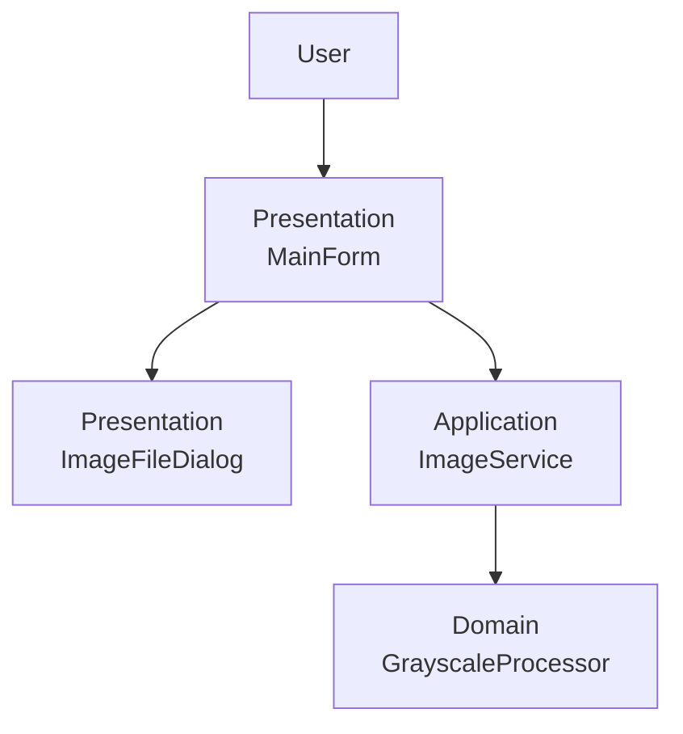

# Image Viewer

Image Viewer is a C# Windows Forms application for learning digital image processing through incremental course practices.

The project started as a basic image viewer. It now includes a first pixel-level transformation: grayscale conversion using `GetPixel()` and `SetPixel()` so the relationship between a bitmap, pixel coordinates, and RGB channels stays visible in the code.

## Project Purpose

This project is built to practice:

- C# Windows Forms created entirely through code
- Layered architecture
- Image loading from disk
- `Bitmap` and `Image` resource management
- Raster image representation
- Pixel coordinates
- RGBA color channels
- Pixel-by-pixel image transformations
- Separation between UI, orchestration, and processing logic

The project is intentionally small. It is not a full image editor and does not try to hide the educational pixel-processing model behind advanced abstractions.

## Current Features

The current implementation supports:

- Selecting an image from disk with an `OpenFileDialog`
- Displaying the selected image in a `PictureBox`
- Preserving image proportions with `PictureBoxSizeMode.Zoom`
- Displaying the selected file path in a read-only `TextBox`
- Disabling filter controls until an image is loaded
- Keeping the original image separate from generated processed images
- Applying a grayscale transformation
- Applying a linear-light grayscale transformation
- Restoring the original image after viewing a grayscale result
- Disposing replaced processed bitmaps and previous originals

Only `Original`, `Grayscale`, and `Linear Grayscale` controls exist. Other filters are future work.

## Image Processing Model

The project treats a raster image as a two-dimensional matrix of pixels:

```text
Pixel(x, y)
```

Each pixel contains color channel values:

```text
R
G
B
A
```

The current processing model traverses the bitmap by row and column:

```text
for every y row
    for every x column
        read pixel(x, y)
        transform it
        write result(x, y)
```

This model is direct and easy to inspect, which is why the current grayscale implementation uses `GetPixel()` and `SetPixel()`.

## Grayscale Transformation

The grayscale transformation is implemented in `Domain/Processing/GrayscaleProcessor.cs`.

For each pixel, the processor reads the red, green, and blue values and calculates:

```text
Gray = 0.299R + 0.587G + 0.114B
```

The output pixel uses the same grayscale intensity for all RGB channels:

```text
R = Gray
G = Gray
B = Gray
```

The alpha channel is preserved:

```csharp
Color.FromArgb(pixel.A, gray, gray, gray)
```

The weighted formula approximates perceived luminance. It is different from a simple arithmetic mean because human vision is more sensitive to green than to blue.

`GetPixel()` and `SetPixel()` are used intentionally for educational clarity. They are not the fastest option for large images; more advanced techniques such as `Bitmap.LockBits` may be studied later, but they are outside the current implementation.

The project also includes `LinearGrayscaleProcessor`, which first converts standard sRGB channels to linear RGB, computes luminance in linear light, and converts the grayscale value back to standard sRGB. This gives the user a direct comparison between a simple weighted grayscale filter and a gamma-aware grayscale filter.

## Architecture

The project uses a simple layered dependency direction:

```text
Presentation -> Application -> Domain
```



- `Presentation` owns Windows Forms UI and user interaction.
- `Application` coordinates image loading and processing operations for the UI.
- `Domain` contains the image-processing algorithm.

The Domain layer does not depend on Windows Forms controls, dialogs, or presentation classes.

See [Architecture](docs/architecture.md) for a deeper explanation.

## Repository Structure

```text
image-viewer/
|-- Application/
|   `-- Services/
|       `-- ImageService.cs
|-- Domain/
|   `-- Processing/
|       |-- GrayscaleProcessor.cs
|       `-- LinearGrayscaleProcessor.cs
|-- Presentation/
|   |-- Dialogs/
|   |   `-- ImageFileDialog.cs
|   `-- MainForm.cs
|-- docs/
|   |-- architecture.md
|   |-- image-processing.md
|   `-- diagrams/
|       |-- grayscale-processing-flow.mmd
|       |-- image-loading-flow.mmd
|       `-- layered-architecture.mmd
|-- Program.cs
|-- ImageViewer.csproj
|-- .gitattributes
|-- .gitignore
`-- README.md
```

Generated directories such as `bin/`, `obj/`, `.vs/`, and `artifacts/` are not part of the source structure.

## User Workflow

Current image loading workflow:

```text
Select Image
    -> ImageFileDialog
    -> selected file path
    -> ImageService.LoadImage
    -> original Bitmap
    -> PictureBox
    -> read-only path TextBox
```

Current grayscale workflow:

```text
Grayscale or Linear Grayscale
    -> ImageService
    -> Domain processor
    -> processed Bitmap
    -> PictureBox
```

`Original` restores the preserved original bitmap without reloading the file from disk.

## Image Lifecycle

The form maintains two conceptual image states:

- `originalImage`: the currently selected source bitmap.
- `processedImage`: the currently displayed generated result, when a filter has been applied.

Selecting a new image detaches the current `PictureBox.Image`, disposes the previous processed image, disposes the previous original image, stores the new original, and displays it.

Applying grayscale creates a new bitmap. Replacing a processed bitmap disposes the previous processed bitmap after the `PictureBox` is updated.

Closing the form detaches the `PictureBox` and disposes the remaining image resources.

## Running the Project

Requirements:

- .NET SDK with `net10.0-windows` support
- Windows, because the project targets Windows Forms
- No database or external runtime service

Commands from the repository root:

```bash
dotnet restore
dotnet build
dotnet run --project ImageViewer.csproj
```

## Verification

There is no automated test project at the current stage.

Manual verification should include:

- Application launches.
- Filter buttons are disabled before selecting an image.
- An image can be selected from disk.
- The selected image appears in the `PictureBox`.
- The selected path appears in the read-only `TextBox`.
- `Grayscale` displays a grayscale result.
- `Original` restores the source image.
- Repeated `Original` and `Grayscale` clicks remain stable.
- Selecting a different image resets the original and processed image state.

## Documentation

- [Architecture](docs/architecture.md)
- [Image processing](docs/image-processing.md)
- [Layered architecture diagram](docs/diagrams/layered-architecture.mmd)
- [Image loading flow diagram](docs/diagrams/image-loading-flow.mmd)
- [Grayscale processing flow diagram](docs/diagrams/grayscale-processing-flow.mmd)

## Development Approach

The repository is developed incrementally through course practices:

```text
Practice 1
Basic image viewer
    |
    v
Practice 2
Pixel-level grayscale transformations
    |
    v
Future practices
Additional image-processing operations
```

The layered structure exists so future image-processing algorithms can be added without embedding pixel loops directly in the Windows Forms UI.

## Future Practices

Future practices may add operations such as negative, thresholding, brightness, contrast, or other pixel transformations.

These are not implemented yet. The current repository only implements the image viewer, original-image restoration, basic grayscale conversion, and linear-light grayscale conversion.
